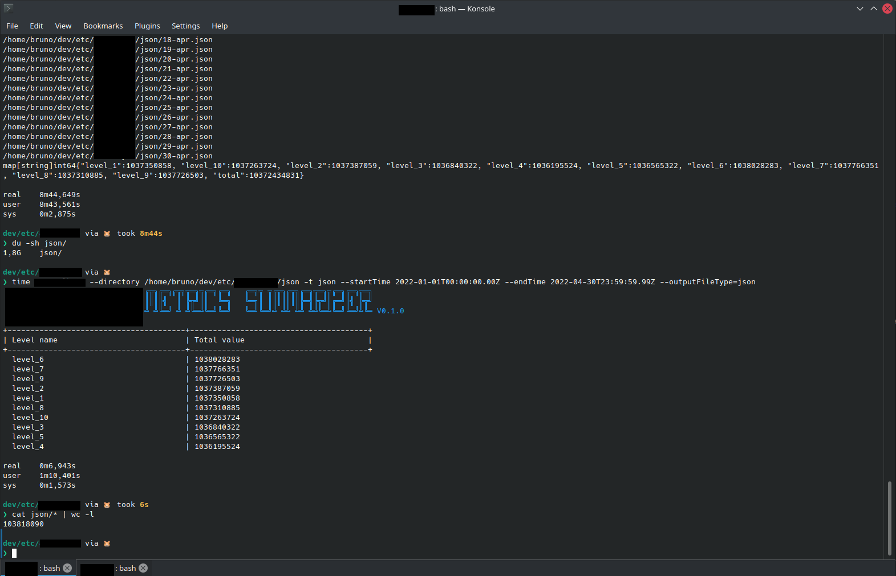

# acme-inc METRICS SUMMARIZER

## How to install

`go install go-challenge`

## Usage

See the list of available arguments: `go-challenge -h` or `go-challenge --help`

```text
--directory     -d      Required        Directory path, the directory contains single type of file, it can be csv or json
--type          -t      Required        Type of the input files, supported format: json and csv
--startTime             Required        Starting time to scan the data in the format of rfc3339, inclusive
--endTime               Required        Ending time to scan the data in the format of rfc3339, exclusive
--outputFileName        Optional        Name of the output file of the summary. Default is 'out'
--outputFileType        Optional        Output type of the summary, supported value: json(default) and yaml
--generate              Optional        Generate test files with random values following the configuration from the other args.
--help          -h                      Prints help information 
```

### `--generate` 

generate random test files


### Performance

It processed 1.8GB of json files (created using `--generate`) containing almost 104 million lines in 6.9 seconds.

